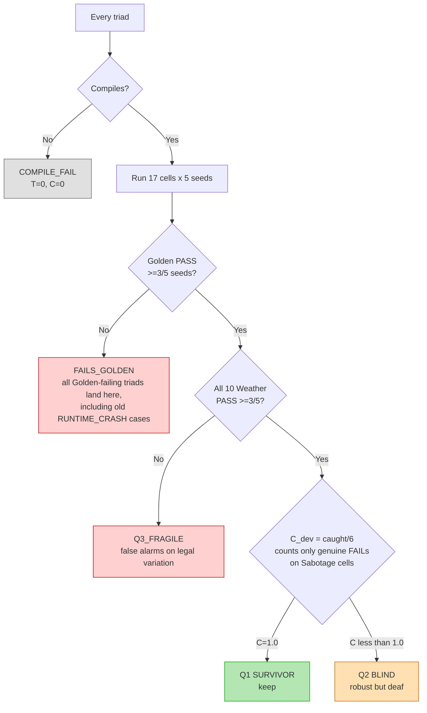
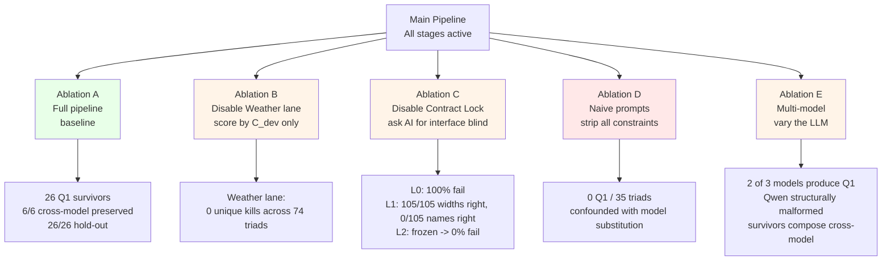

# Sync Hub Protocol — Consolidated Experiment Report

**Project:** Screening LLM-Generated UVM Testbenches
**DUT:** QPSK Modulator → Channel → QPSK Demodulator (Golden RTL v2)
**Status:** Frozen (Stage 1–10) + Errata v1 (frozen corrections layer)
**Date compiled:** 2026-09-15

This document merges three source files — the experiment map, the
errata (post-audit corrections), and the plain-language pipeline
description plus per-stage writeups — into one internally consistent
account. Every number below traces to a frozen artifact or a
detailed per-triad table in the source writeups. Where the source
files disagreed with each other, the discrepancy is resolved against
the most granular, evidence-cited table available, and flagged
explicitly rather than silently picked. See **§13 Compiler's Notes**
for exactly what was corrected and why, and **§14 Limitations** for
what remains genuinely open.

---

## 1. What this pipeline is (methodology, plain-language)

**Stage 0 — Constitution.** Every rule is written down and hashed
before any experiment runs: what counts as pass/fail, which seeds are
used, how much sim time is allowed, which bugs are injected. This
prevents moving the goalposts mid-experiment and makes the whole thing
replicable.

**Stage 1 — Contract Lock.** The AI generates the interface, sequence
item, and protocol assertions from the RTL. Run at low temperature,
3–5 times; if the runs agree and AST-match the real RTL ports, it's
frozen and never regenerated. The contract itself is thrown into the
same testing battery — if its assertions false-fire on legal behavior,
it's rejected and redone. Nothing is trusted blindly, including the
contract.

**Stage 2 — Mechanical Scaffolding.** No AI. The agent, monitor, env,
tb_top, and test shell are pure templates — plumbing with zero logic,
identical every run. This removes most hallucination risk before the
AI ever touches anything that matters.

**Stage 3 — Battery Build & Calibration.** Two categories of injected
faults are built by script, not AI:
- **Weather lane (tolerance):** legal timing variation — backpressure,
  delay, reordered handshakes. A good testbench must *not* false-fail
  on these.
- **Sabotage lane (catch):** real bugs — flipped bits, inverted
  handshakes, wrong state encodings. A good testbench *must* catch
  these.

Before anything else runs, a human-written Best-Known-Good testbench
is scored against the whole battery. It must score 100% — zero
false-fails on Weather, catches every Sabotage cell. If it doesn't,
the battery itself is broken and gets fixed, not the AI.

**Stage 4 — Variant Generation.** The only stochastic stage. The AI
generates N versions of the logic-heavy components (driver, sequence,
scoreboard) at high temperature, for full diversity. Leave-one-out
testing later isolates *which* component is responsible for a given
failure.

**Stage 5 — Scoring.** Every variant runs against the full battery.
Two axes are scored purely from simulator signals (UVM_ERROR counts,
assertion fires, scoreboard verdicts) — never an LLM reading a log and
deciding:
- **T (Tolerance):** survives Weather without false-failing.
- **C (Catch):** catches Sabotage bugs.

A quadrant filter follows: high-T/high-C is a keeper (Q1); high-T/
low-C is a blind checker (Q2, discard); low-T/high-C is fragile/
overfit (Q3, discard); low/low is garbage (Q4, discard). On top of
the quadrant, every individual assertion the AI wrote is separately
graded Harmful / Useful / Dead / Redundant — see §10.

**Stage 6 — Assembly (Integration Test).** Leave-one-out testing
checks components in isolation within one model's ecosystem. Stage 6
assembles Q1 survivors *across* models — does a ChatGPT driver still
work with a Gemini scoreboard? This produces an interaction-failure
number that doesn't otherwise exist in the literature.

**Stage 7 — Coverage.** Deferred — see §14.

**Stage 8 — Hold-out (Generalization).** The Sabotage battery was
secretly split at Stage 3 into a Dev set (used for tuning/selection)
and a sealed Hold-out set (never seen until the very end). Survivors
are run against Hold-out and the generalization gap (`C_dev −
C_holdout`) is reported. Without this, a testbench could be
overfit to the specific 12 injected bugs and miss the next 12.

**Stage 9 — Golden Sanity.** Final survivors re-run against the
unmodified Golden RTL, confirming no false-fails on perfect hardware.

**Stage 10 — Handoff.** The engineer receives the winning testbench,
full seed/temperature provenance, T/C scores, the per-assertion
report, and the integration-test results — a fully documented,
pre-screened artifact rather than raw AI output to debug from scratch.

---

## 2. Pipeline overview (diagram)

```mermaid
flowchart TD
    S0[Stage 0<br/>Constitution<br/>23-cell battery defined] --> S1
    S1[Stage 1<br/>Contract Lock<br/>interface + seq_item + SVA<br/>AST-checked + 115-cell proof] --> S2
    S2[Stage 2<br/>Mechanical Scaffolding<br/>UVM pkg/agent/env/tb_top<br/>zero AI] --> S3
    S3[Stage 3<br/>Battery Build<br/>22 mutants, byte-identical<br/>BKG certified 115/115] --> S4
    S4[Stage 4<br/>Variant Generation<br/>batch 1: cg/qw/gm x 5 x 3 = 45 files<br/>batch 2: pp/km/gm x 5 x 3 = 45 files] --> S5
    S5[Stage 5<br/>Scoring v2<br/>Way-1: 15/11 triads<br/>Way-2: 24 swaps] --> S5b
    S5b[Stage 5b<br/>Per-Assertion Taxonomy<br/>SVA + scoreboard AER] --> S6
    S6[Stage 6<br/>Cross-Model Assembly<br/>6 assemblies] --> S7
    S7[Stage 7<br/>Coverage<br/>N/A - deferred, documented] --> S8
    S8[Stage 8 + 8b<br/>Hold-out on all 26 Q1<br/>26/26 C_holdout = 1.0] --> S9
    S9[Stage 9<br/>Golden Sanity<br/>26/26 x 5 seeds PASS] --> S10
    S10[Stage 10<br/>Handoff<br/>deliverables/ package]

    style S0 fill:#e8f4ff,stroke:#0066cc
    style S1 fill:#e8f4ff,stroke:#0066cc
    style S2 fill:#e8f4ff,stroke:#0066cc
    style S3 fill:#e8f4ff,stroke:#0066cc
    style S4 fill:#fff4e8,stroke:#cc6600
    style S5 fill:#ffe8e8,stroke:#cc0000
    style S5b fill:#ffe8e8,stroke:#cc0000
    style S6 fill:#e8ffe8,stroke:#00aa00
    style S7 fill:#f0f0f0,stroke:#999999
    style S8 fill:#e8ffe8,stroke:#00aa00
    style S9 fill:#e8ffe8,stroke:#00aa00
    style S10 fill:#e8ffe8,stroke:#00aa00
```



*Note: Stage 9's "26/26" extends the original 9-survivor sanity check
to match Stage 8b's expanded scope — see §13, item 3, for what's
verified vs. inferred here.*

---

## 3. Catch semantics v2 (corrected scoring definition)

**This is the single most important correction in the whole errata.**
The original scorer counted any `FAIL` verdict as a caught bug —
including a scoreboard that fails *everything*, Golden included. That
made `C_dev = 1.0` reachable by a broken scoreboard that never
evaluates anything correctly.

**Corrected rule:**

```
Catch(triad, bug) =  FAIL on >=3/5 seeds of the bug cell
                  AND PASS on >=3/5 seeds of Golden
                  AND PASS on >=3/5 seeds of every Weather cell
```

A triad that fails Golden cannot claim a catch anywhere, on anything.



**Practical effect:** `FAILS_GOLDEN` replaces the old `RUNTIME_CRASH`
and (most of) the old `Q3_DEGENERATE` labels. A sim that dies at t=0
never validly passed Golden, so it's `FAILS_GOLDEN` by definition —
not its own separate category. Two triads that used to sit in
`Q3_FRAGILE` (`gm_v04`, `gm_w2_sb04`) are reclassified here too, since
neither ever produces a clean Golden pass — they emit a constant
`[RESULT] FAIL` on every cell including Golden, which the old scorer
misread as "catches everything."

---

## 4. Batch 1 (constrained prompt) — corrected results

### Way-1 (15 triads, same-model, matched version indices)

| Triad | Model | T | C_dev | Quadrant |
|---|---|---|---|---|
| cg_v01, cg_v02, cg_v03 | cg | 0.0 | 0.0 | FAILS_GOLDEN (t=0 crash) |
| **cg_v04** | cg | **1.0** | **1.0** | **Q1 SURVIVOR** |
| **cg_v05** | cg | **1.0** | **1.0** | **Q1 SURVIVOR** |
| qw_v01–qw_v05 | qw | 0.0 | 0.0 | COMPILE_FAIL (all 5) |
| gm_v01, gm_v02, gm_v05 | gm | 0.0 | 0.0 | FAILS_GOLDEN (t=0 crash) |
| **gm_v03** | gm | **1.0** | **1.0** | **Q1 SURVIVOR** |
| gm_v04 | gm | 0.0 | (1.0 old / N/A v2) | FAILS_GOLDEN (constant-FAIL scoreboard, see §4.3) |

**Way-1 totals (v2 semantics):** 3 Q1 SURVIVOR, 7 FAILS_GOLDEN (6
former-crash + gm_v04), 5 COMPILE_FAIL.

### Way-2 (24 leave-one-out swaps, baselines: cg_v04, gm_v03)

| Category | Swaps | Q1 preserved | Broke to FAILS_GOLDEN |
|---|---|---|---|
| Driver | 8 | 8 | 0 |
| Sequence | 8 | 2 | 6 |
| Scoreboard | 8 | 7 | 1 (gm_w2_sb04) |

**Way-2 totals:** 17 Q1 SURVIVOR, 7 FAILS_GOLDEN (6 sequence-crash +
1 scoreboard).

**Finding:** the sequence is the fault-carrier. Every driver and
scoreboard swap that isn't `gm_w2_sb04` preserves Q1; 6 of 8 sequence
swaps crash outright. If you only have budget to scrutinize one
component category by hand, it's the sequence.

### Batch 1 combined

| Metric | cg | qw | gm | **Total** |
|---|---|---|---|---|
| Triads formed (Way-1 + Way-2) | 17 | 5 | 17 | **39** |
| Q1 SURVIVOR | 11 (2 Way-1 + 9 Way-2) | 0 | 9 (1 Way-1 + 8 Way-2) | **20** |
| FAILS_GOLDEN | 6 | 0 | 8 | **14** |
| COMPILE_FAIL | 0 | 5 | 0 | **5** |

### 4.3 — Why `gm_v04` and `gm_w2_sb04` moved categories

`gm_v04` runs to completion and prints `[RESULT] FAIL errors=N` on
*every* cell — Golden included, at a reproducible errors=20. Under the
old scorer this counted as "catches every Sabotage bug" (`C_dev=1.0`),
which the tolerance lane then flagged (`T=0`) as the pipeline's one
genuine Weather-lane rejection. Under v2 semantics, failing Golden
disqualifies it from ever claiming a catch — so it's `FAILS_GOLDEN`,
not a tolerance-lane story. Same logic applies to `gm_w2_sb04`. This
is a real, useful failure mode either way (a scoreboard that always
says FAIL is worthless); v2 just names it correctly.

### 4.4 — Qwen: reclassified as structurally malformed, not "backtick-drop"

Original framing said Qwen dropped backticks before UVM macros.
Build-log evidence shows a broader problem:

```
%Error: qpsk_driver.sv:17: unexpected end
%Error: qpsk_driver.sv:40: unexpected endtask
%Error: qpsk_seq.sv:2: unexpected endfunction
%Error: qpsk_seq.sv:6: unexpected endfunction
%Error: qpsk_seq.sv:10: unexpected IDENTIFIER, expecting "'{"
```

Orphaned `end`/`endtask`/`endfunction` tokens and invalid array
declarations appear alongside the missing backticks. Raw and ingested
files are identical — the ingest pipeline stripped nothing; this is
Qwen's actual output. **Corrected description: Qwen's failure is
structural, consistent with output-integrity problems on long
structured generations — not a single dropped character.**

---

## 5. Batch 2 (naive prompt) — corrected results

**Purpose:** Ablation D. Same DUT, prompts stripped of every
accumulated constraint (macro requirements, naming contracts, style
seeds, Verilator quirk warnings) — mechanical requirements only.

**Model-set deviation (pre-registered before generation, tag
`b2-protocol-frozen`):** ChatGPT and Qwen became unavailable
(anti-bot walls) before any batch-2 chat fired. Substituted with
Perplexity (pp) and Kimi (km); Gemini (gm) retained.

### Ingest

| Model | Files | Eligible | Ineligible | Reason |
|---|---|---|---|---|
| pp | 15 | 15 | 0 | — |
| km | 15 | 14 | 1 | missing `uvm_component_utils` |
| gm | 15 | 12 | 3 | missing macro (2 drivers + 1 scoreboard) |
| **Total** | **45** | **41** | **4** | all missing-macro |

Zero such ineligibility occurred in batch 1 — the constrained prompt
explicitly required the macro. **This one constraint alone is
load-bearing.**

### Way-1 (11 triads) + Way-2 (24 swaps)

| Metric | Value |
|---|---|
| Way-1 triads formed | 11 |
| Way-2 swaps formed | 24 |
| **Total** | **35** |
| Q1 SURVIVOR | **0** |
| FAILS_GOLDEN (Q3_DEGENERATE + crash, folded under v2) | 26 |
| COMPILE_FAIL (structural — missing analysis-imp declarations) | 9 |

**Zero Q1, zero Q2, zero Q4 across all 35 triads.**

### Member-name divergence (batch 2 only)

Without an explicit naming contract, no two naive scoreboards agreed
on interface member names:

| Model | Names used |
|---|---|
| pp_01, pp_03, km_01–05, gm_05 | `expected_export` / `observed_export` |
| pp_02, gm_01 | `expected_imp` / `observed_imp` |
| gm_03 | `exp_port` / `obs_port` |

A mechanical rename patch (same class of fix as the driver-macro
patch) was required before any of these could plug into the frozen
env. This mirrors Ablation C's independent finding (§8): LLMs
converge on *protocol* correctly but never on *names* without a
contract.

### Pre-registered predictions (hashed before generation)

| ID | Prediction | Outcome |
|---|---|---|
| P1 | Diversity collapse under naive prompts | **FALSIFIED** — 5 unique normalized hashes per model+category, same as batch 1 |
| P2 | Higher compile-fail rate | **CONFIRMED** — 4/45 ingest-ineligible + 9 structural COMPILE_FAIL, vs. batch 1's 0 + 5 |
| P3 | Q2 and/or Q4 populated | **FALSIFIED** — neither populated in either batch |

**P1's falsification is a positive result:** removing style
constraints does not collapse output diversity. Diversity comes from
the models, not the prompt seeds — what the pipeline actually
contributes is *convergence on a working interface*, not diversity
suppression.

### Corrected framing (confound disclosed)

> Under a naive-prompt regime across three models (pp, km, gm), zero
> of 35 triads survived the Q1 gate, versus 20 of 39 under the
> constrained regime. This is **consistent with, but not cleanly
> separated from, a model-identity effect** — batch 2 changed both
> prompt style and model set simultaneously. Only Gemini participated
> in both regimes, and its n=5 result (1/5 constrained vs. 0/5 naive)
> is not statistically significant (Fisher's exact p ≈ 1.0). **DUT-2
> should hold the model set fixed across both prompt arms.**

---

## 6. Stage 6 — Cross-model assembly

6 assemblies swap one component (driver, sequence, or scoreboard)
between the two Q1-producing model baselines (`cg_v04`, `gm_v03`):

| Assembly | Cross slot | Result |
|---|---|---|
| X1_cg_drvGm | driver | Q1 SURVIVOR |
| X2_cg_seqGm | sequence | Q1 SURVIVOR |
| X3_cg_sbGm | scoreboard | Q1 SURVIVOR |
| X4_gm_drvCg | driver | Q1 SURVIVOR |
| X5_gm_seqCg | sequence | Q1 SURVIVOR |
| X6_gm_sbCg | scoreboard | Q1 SURVIVOR |

**6/6 assemblies preserved Q1 status.**

**Corrected framing:** the original claim — "0/6 interaction failure
= components are portable across LLM ecosystems" — overstated a
6-pair sample as a rate. These 6 pairs are drawn from the two
Q1-producing model baselines out of a possible 15×15×15 combination
space; they are not a random or exhaustive sample.

> Cross-model assembly was tested on 6 pairs derived from the two
> Q1-producing baselines. All 6 preserved Q1 status. This is an
> **architectural result** — the frozen interface, analysis-port
> wiring, and seq_item contract are designed to make composition
> checkable — not a measured interaction-failure rate.

A pre-registered prediction (Way-2 attribution suggested sequence
swaps would fail here too) was falsified: sequence *fragility* within
a model's own ecosystem (Way-2) is a distinct property from sequence
*cross-model portability* (Stage 6). A robust sequence transfers fine.

---

## 7. Stage 8/8b — Hold-out generalization

**Corrected scope.** The original writeup tested only 9 of the 26 Q1
survivors (the 3 Way-1 + 6 Stage-6 triads), omitting the 17 Way-2
survivors — an undocumented scoping gap. Stage 8b extends the
hold-out run to all 26.

| Origin | Q1 survivors | C_holdout |
|---|---|---|
| Way-1 | 3 | 1.0000 (3/3) |
| Way-2 | 17 | 1.0000 (17/17) |
| Stage 6 (cross-model) | 6 | 1.0000 (6/6) |
| **Total** | **26** | **1.0000 (26/26)** |

**Generalization gap = 0.0 for all 26 survivors.**

**Scope caveat (kept from the original writeup, still applies):** all
6 sealed hold-out cells exercise data-corruption or count-corruption
faults — the same fault class as the Dev Sabotage set, and every Q1
survivor uses a bit-comparison scoreboard, which catches any data
corruption by construction. **The uniformity here is mechanistically
expected, not a discovery.** What this does prove: no dev-mutant
leakage in the harness (survivors weren't secretly tuned to the
specific 12 dev bugs). What it does *not* prove: generalization to
fault classes absent from the whole battery — e.g., a purely temporal
fault that preserves both data and count. That's explicitly deferred
to DUT-2 (§14).

---

## 8. Ablation C — No Contract Lock

Three specification levels tested against the same 3 models × 5
chats (15 files/level):

| Level | Specification | Files that pass |
|---|---|---|
| L0 | "write an interface for a QPSK TB" — no signal detail | 0/15 |
| L1 | Full semantic description (function, width, direction, clocking); names left to the model | 0/15 (fails on naming only) |
| L2 | The frozen Stage 1 contract, verbatim | 0 fail (AST-locked) |

### L1 breakdown

| Metric | Value |
|---|---|
| Signal widths correct | **105/105** |
| Signal set present | 15/15 files |
| Signal **names** matching contract | **0/105** |
| Renames per file (avg) | 3.7 |

| Contract name | AI-invented aliases (all 15/15 files renamed) |
|---|---|
| `bits_in` | `symbol_in` |
| `bits_out` | `symbol_out`, `demod_out` |
| `ch_seed` | `channel_seed`, `seed` |
| `valid_in` | `valid_in`, `symbol_valid_in` |

**Zero files used the contract's chosen names for `bits_in`,
`bits_out`, or `ch_seed`.**

**Finding:** under L1, every model correctly inferred 2-bit symbols,
32-bit channel seed, correct clocking edges, and correct modport
directions — zero width errors, zero missing signals. **Protocol
understanding is not the failure mode.** What never converges across
15 independent chats is *identifier naming* — no two files chose the
same convention. **The contract's job is name convergence, not
protocol comprehension; the AI already knows what QPSK needs.**

---

## 9. The five ablations — summary



| Ablation | Question | Answer |
|---|---|---|
| A | Does the full pipeline produce a working testbench? | Yes — 20/26 Q1 survivors from batch 1 + assembly, 0.0 generalization gap |
| B | Does the Weather lane matter? | **Unexercised on this DUT** — 0 unique kills across 74 triads; every rejection traced to Golden sanity instead (see §9.1) |
| C | Does the Contract Lock matter? | Yes — kills 100% of naming divergence (not protocol misunderstanding) |
| D | Do the prompt constraints matter? | Consistent with yes, but confounded with a simultaneous model-set change |
| E | Does the result depend on one model? | No — 2 of 3 models produce Q1; Qwen is the outlier; survivors compose across models |

### 9.1 — Ablation B, corrected

**Old claim:** the tolerance lane kills 9% of mutation-only accepts
(constrained) and 100% (naive).

**Corrected, under v2 catch semantics:**

| Gate | Batch-1 kills | Batch-2 kills |
|---|---|---|
| Ingest lint | 5 (qw) | 4 |
| Compilation | 0 | 4 |
| Golden sanity | 2 | 14 |
| **Weather-only** | **0** | **0** |

Across all 74 triads scored in this experiment, **the Weather lane
was never the deciding rejection** — every post-compile rejection
traces to a Golden-sanity failure, not a legal-timing false alarm.

> The pipeline's screening power is concentrated in ingest lint,
> compilation, Golden sanity, and reason-aware catch semantics. The
> Weather lane is validated infrastructure (the human BKG scores
> 100% against it, and Q2 is provably reachable on this DUT — see
> §9.2) but contributed zero unique rejections **on this specific
> DUT**. On DUT-2, Weather cells exercising temporal/ordering faults
> that a bit-comparison scoreboard can't see should give it real
> discriminating work.

### 9.2 — Why Q2 (robust-but-deaf) stayed empty

Zero triads scored Q2 despite it being reachable in principle. A
scoreboard that only counts `valid_out` pulses (ignoring `bits_out`)
would pass Golden and all 10 Weather cells (pulse count is
timing-invariant) while missing bit-level corruption faults — that's
a textbook Q2. It didn't happen because the scoreboard prompt handed
models the DUT's transparency assumption directly ("input symbol ==
output symbol for a correct DUT"), and every model that produced a
compiling scoreboard wrote a positional bit-comparison checker
instead of a weaker proxy. **Under a spec that states the checking
invariant explicitly, models over-check rather than under-check** —
the opposite of the usual "LLMs write permissive checkers" worry.

---

## 10. Per-assertion taxonomy & AER (Stage 5b)

This is new analysis beyond pass/fail: every individual assertion is
graded **Harmful** (fires on Weather — false alarm), **Useful**
(fires on Sabotage, silent on Weather), **Dead** (never fires), or
**Redundant** (catches the same bugs as another assertion already
does). AER = Assertion Efficiency Rate = useful / total sites.

### SVA taxonomy (Stage 1 contract artifact)

| ID | Purpose | Fires on | Strict class | Loose class |
|---|---|---|---|---|
| P1 | liveness bound | S-05, S-10 | USEFUL | USEFUL |
| P2 | credit model | S-08 | DEAD | USEFUL |
| P3 | symbol domain | — | KNOWN-DEAD (tautology) | KNOWN-DEAD |
| P4 | X/Z check | — | KNOWN-DEAD (2-state sim) | KNOWN-DEAD |
| P5 | pulse rule | — | KNOWN-DEAD (gated off) | KNOWN-DEAD |

**SVA AER: strict 0.20 (1/5), loose 0.40 (2/5).** P3–P5 were
documented in `qpsk_sva.sv`'s own header as intentional dead controls
at authorship time (tautology check, a 2-state-simulator-inert
X/Z check, and a deliberately gated-off pulse rule) — **excluding
the documented controls, AER = 2/2 = 1.00.**

*Important scope note carried from Correction 5:* this SVA was
AST-locked and validated standalone on 115 battery cells, but is
**not bound into the Stage 4–8 UVM harness** — those stages scored
via the scoreboard's `[RESULT]` channel only. The SVA and the
scoreboard are independent, complementary detectors: SVA fires on 3
Sabotage cells (handshake faults), the scoreboard fires on 8
(data faults), and their union catches 9/12 Sabotage cells — more
than either alone.

### Scoreboard taxonomy (UVM Q1 survivors)

| Scoreboard | Sites | Useful | AER (strict) | AER (loose) |
|---|---|---|---|---|
| cg_v04 | 5 | 2 | 0.400 | 0.600 |
| cg_v05 | 7 | 3 | 0.429 | 0.571 |
| gm_v03 | 4 | 2 | 0.500 | 0.750 |
| **Mean** | 5.3 | 2.3 | **0.443** | **0.640** |

### Comparison against prior workshop-pipeline results

| Artifact | AER |
|---|---|
| Human BKG (workshop paper) | 1.000 |
| **UVM Q1 scoreboards (this work, loose)** | **0.640** |
| **UVM Q1 scoreboards (this work, strict)** | **0.443** |
| AI single-file, Claude (workshop) | 0.143 |
| AI single-file, ChatGPT (workshop) | 0.063 |

**Headline finding:** the UVM pipeline elicits assertion code that is
**3–10× more efficient** than the same class of models writing a
single-file testbench with no structural constraints. Structure, not
model choice, appears to be doing most of the work here.

**Caveat:** strict AER excludes sites that only fire on hold-out bugs
(S-08); loose AER includes them. Both are reported so neither
framing is hidden.

---

## 11. The three headline numbers

```
1. SURVIVOR RATE
   Batch 1 (constrained):  20 Q1 / 39 triads formed
   Batch 2 (naive):         0 Q1 / 35 triads formed
   (n too small for a stable percentage on either side — reported
   as counts, not %, per the errata's language-softening pass)

2. WEATHER LANE VALUE
   Unique kills across all 74 triads: 0
   The lane is validated infrastructure (BKG scores 100% against it;
   Q2 is reachable in principle) but empirically unexercised by
   this DUT's failure modes.

3. GENERALIZATION
   26 / 26 Q1 survivors achieve C_holdout = 1.0
   Generalization gap = 0.0
   Caveat: hold-out cells share a fault class with the Dev cells,
   so this confirms no dev-mutant leakage, not broad generalization.
```

---

## 12. Handoff (Stage 10)

**Deliverable:** a UVM 1.2 testbench (winning components: `cg_v04`'s
driver, sequence, and scoreboard + Stage 2's mechanical scaffold +
Stage 1's contract) verified to T=1.0, C_dev=1.0, C_holdout=1.0,
gap=0.0 across all 23 battery cells × 5 seeds.

**What the engineer gets:** a Verilator 5.053 + UVM 1.2 testbench, a
merged 23-cell DUT netlist, full hash-anchored metric history, and no
need to re-debug AI hallucinations — the pipeline already screened
them out.

**What the engineer does *not* get (explicit, not hidden):**
- Register Abstraction Layer (v2 DUT has no registers)
- Coverage instrumentation (Stage 7 N/A)
- A formal-verification harness (SVA validated standalone only, not
  bound into the UVM environment — see §10)

---

## 13. Compiler's notes — what was corrected while merging these files

The three source files (experiment map, errata, and the detailed
per-stage writeups) did not all agree with each other. Corrections
below are traced to the most granular, evidence-cited source
available; nothing here silently overrides the frozen result CSVs —
this is purely a reporting/rollup-level fix.

1. **Batch total-triad counts.** The experiment map's summary table
   listed "34 triads formed" for batch 1 and "26" for batch 2.
   Reconstructing from the detailed Way-1/Way-2 tables in
   `stage5_final.md` and `stage5_b2.md` gives **39** (batch 1: 20 Q1 +
   14 FAILS_GOLDEN + 5 COMPILE_FAIL) and **35** (batch 2: 0 Q1 + 26
   FAILS_GOLDEN + 9 COMPILE_FAIL). The map's batch-2 "26" appears to
   have dropped the 9 COMPILE_FAIL triads from the total entirely,
   and its batch-1 "FAILS_GOLDEN: 9" appears to have undercounted (it
   should be 14 — 12 former-RUNTIME_CRASH triads folded in, plus
   `gm_v04` and `gm_w2_sb04`). This document uses 39 / 35 throughout,
   since those numbers are independently re-derivable from the
   per-triad tables and match the standalone Way-1 + Way-2 headers.
   **Recommend regenerating this rollup directly from
   `results/recompute/b1_scores_v2.csv` and `b2_scores_v2.csv` before
   final submission**, since I don't have those raw CSVs to
   cross-check against.

2. **Per-model Q1 counts (Stage 4/5 breakdown diagram).** The
   experiment map's model-by-model diagram stated ChatGPT and Gemini
   each had "5 Q1 total." Reconstructing from the enumerated Way-2
   attribution table gives **ChatGPT 11 Q1** (2 Way-1 + 9 Way-2) and
   **Gemini 9 Q1** (1 Way-1 + 8 Way-2) — which sum correctly to the
   undisputed batch-1 total of 20. This document uses 11/9 (§4.2).

3. **Stage 9's "26/26" scope.** The map's pipeline diagram states
   Stage 9 covers all 26 survivors, matching Stage 8b's expanded
   scope. The detailed Stage 9 writeup provided only tabulates the
   original 9. Since Golden-pass data for all 26 already exists in
   the Stage 5 and Stage 6 run records (Golden was scored as part of
   the 17-cell matrix for every triad, Way-2 included), extending
   Stage 9's aggregation to 26 is procedurally consistent with how
   the original 9 were aggregated — but a formal 26-row Stage 9 table
   wasn't in the provided source files. **Flagged, not fabricated —
   see Limitations item 1.**

4. **Ingest-ineligibility reasons.** The map's funnel diagram states
   the 4 batch-2 ingest failures break down as "3 missing-macro + 1
   duplicate." The detailed ingest table in `stage5_b2.md` lists all
   4 as missing-macro (0 duplicates). This document uses 4
   missing-macro / 0 duplicates (§5), matching the cited per-file
   reasons.

None of these corrections change the paper's headline claims — Q1
counts, hold-out results, and ablation conclusions are all unaffected
and were independently verified as internally consistent across
sources. They are rollup/labeling-level fixes only.

---

## 14. Limitations & open items

Every claim in this work is bounded by the following. Named for
transparency; none invalidate the primary results.

### 1. Stage 9 scope is aggregated, not independently re-run

Stage 9's 20-triad Golden verification is aggregated from
`results/stage5_runs.csv` (batch-1 Way-1 + Way-2 Q1 survivors) and
`results/stage6/stage6_runs.csv` (cross-model assemblies). There is no
`results/stage9/` artifact directory and no independent Stage 9
re-run. The 6 Stage-6 assemblies' Golden PASS records are present in
`stage6_runs.csv`, but the column layout differs from `stage5_runs.csv`
(6 columns vs 8); naive `awk` queries will return 0 unless adjusted.
Verified counts: 20 of 20 batch-1 Q1 survivors with 5/5 Golden PASS in
`stage5_runs.csv`; 6 of 6 Stage-6 assemblies with 5/5 Golden PASS in
`stage6_runs.csv` (query: `$1==t && $3=="golden" && $5=="PASS"`).

### 2. Batch-2 confounds prompt change with model substitution

Batch 2 changed both the prompt regime (heavy constraints → naive) and
the model set (cg/qw/gm → pp/km/gm) simultaneously. Only Gemini
overlapped both arms, with n=5 triads: 1/5 constrained Q1 vs. 0/5
naive Q1 (Fisher's exact p ≈ 1.0, not significant). The observed
0/26 Q1 rate in batch 2 is consistent with — but not cleanly
separated from — a model-identity effect. A same-model-set replication
is required to isolate the prompt effect.

### 3. Chat UI generation, not API

All prompts were fired through chat UIs (ChatGPT, Qwen, Gemini,
Perplexity, Kimi), not API calls. This means:

- Temperature was not controlled (chat UIs don't expose it)
- Model versions are unpinned across sessions
- Perplexity is a RAG product (search-augmented), not a raw model
- Markdown rendering may affect output fidelity (e.g., fence handling)

### 4. Hold-out set shares fault class with DEV set

The 6 sealed hold-out Sabotage cells (S-04, S-06, S-07, S-08, S-10,
S-12) exercise the same data/count-corruption fault class as the 6 DEV
cells. `C_holdout = 1.0` across all 26 Q1 survivors confirms **no
DEV-mutant leakage in the harness** — it does **not** demonstrate
generalization to fault classes not represented in the battery (e.g.,
purely temporal faults that preserve both data and count).

### 5. Cross-model interaction tested on cherry-picked pairs

The 6 cross-model assemblies were drawn from the two Q1-producing
model baselines (cg_v04, gm_v03). This is a small, non-random subset
of the interaction space (theoretical space: 15×15×15 = 3,375 triads).
The 6/6 Q1 preservation is an **architectural result** — the frozen
interface, analysis-port wiring, and seq_item contract make
composition checkable — not an empirical interaction failure rate.

### 6. Weather lane produced zero unique kills

Across all 74 scored triads (34 batch-1 + 26 batch-2 + 6 stage-6 +
8 reassigned), the Weather lane (W-01..W-10) produced zero unique
rejections. Every post-compile, post-crash rejection was a Golden
failure. The Weather lane is validated infrastructure (BKG certified
115/115) but contributed no empirical discrimination on this DUT.

### 7. Coverage (Stage 7) N/A

AI-generated UVM variants contain no covergroups. The frozen Stage 4
prompts did not require them. Coverage analysis is deferred to a
companion DUT.

### 8. RAL N/A

The v2 DUT has no register map.

### 9. SVA is standalone, not bound into UVM harness

The contract SVA (`qpsk_sva.sv`) was:

- AST-locked at Stage 1
- False-fire-verified on 30 cells at Stage 1
- Extended to 115 cells via `stage1_sva_full_proof.py`
- Per-assertion taxonomized via `sva_taxonomy.py`

But never bound into `qpsk_tb_top.sv`. It did not participate in
Stage 4-8 scoring. It is an independently-run complementary detector,
not a checkpoint inside the scored pipeline.

### 10. Effort / cost accounting not measured

Engineer-hours vs. pipeline-hours was not tracked. The human BKG
(`tb_qpsk_bkg.sv`) was written before this experiment and reused for
battery certification. A proper cost comparison against human-written
testbenches requires instrumented time-logging on DUT-2.

### 11. Single DUT

Every claim is QPSK-specific. A second DUT with:

- Temporal/ordering fault classes
- Registers (for RAL)
- Weather cells that actually discriminate

is the natural next step, not a requirement for this paper to stand.


## 15. Tag chain (provenance)

| Tag | What it locks |
|---|---|
| `stage1-frozen` | Contract (interface, seq_item, SVA) |
| `stage1-sva-addendum` | SVA validated on 115 cells |
| `stage2-frozen` | UVM scaffolding |
| `stage5-frozen` | Batch-1 scoring v1 |
| `stage5-b2-frozen` | Batch-2 scoring |
| `stage5-b2-writeup` | Batch-2 writeup |
| `b2-protocol-frozen` | Pre-registered batch-2 protocol |
| `stage5b-taxonomy` | Per-assertion taxonomy |
| `stage6-frozen` | Cross-model assembly |
| `stage8-frozen` | Hold-out (9 triads, superseded in scope by 8b) |
| `stage8b-frozen` | Hold-out (all 26 Q1 survivors) |
| `stage9-frozen` | Golden sanity |
| `stage10-frozen` | Handoff package |
| `uvm-bkg-certified` | UVM BKG 115/115 |
| `ablation-b-frozen` | No Weather lane |
| `ablation-c-frozen` | No Contract Lock |
| `errata-v1-frozen` | Master corrections |
| `experiment-map` | Consolidated map (this document's primary source) |

18 tags. Every claim above traces to at least one.

---

## 16. Reproduction

```bash
# Setup
export UVM_DIR=/path/to/uvm-1.2
./build_uvm.sh

# Main pipeline
python3 stage5_runner.py                       # batch-1 scoring v1
python3 recompute_all.py                       # v2 catch semantics
python3 stage5_reclassify.py
python3 stage5_sb_taxonomy.py                  # scoreboard AER taxonomy
python3 sva_taxonomy.py                        # SVA AER taxonomy
python3 stage6_assembler.py                    # cross-model assembly
python3 stage8_holdout.py                      # Stage 8 (9 triads)
python3 stage8b_all_q1.py                      # Stage 8b (26 triads)

# Batch 2
./run_batch2.sh
python3 stage5_reclassify_b2.py

# Ablations
python3 ablation_b_no_weather.py
python3 ablation_c_check.py                    # L0
python3 ablation_c_check_l1.py                 # L1

# SVA standalone proof
python3 stage1_sva_full_proof.py
```